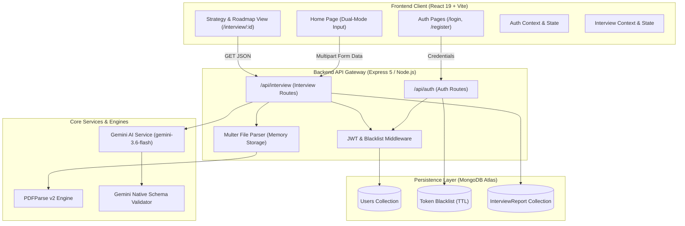
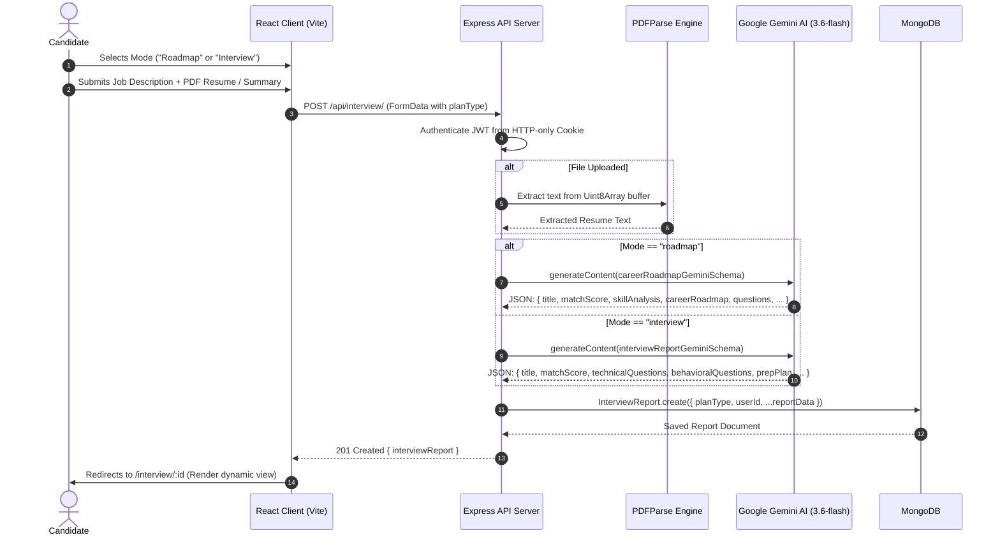

# System Architecture & Design Specification

> **Project Name:** Cognitive Suite: Noir — AI Career Strategy & Interview Preparation System  
> **Version:** 2.0.0  
> **Author:** Development Team  
> **Last Updated:** August 2026  

---

## 1. Executive Summary

**Cognitive Suite: Noir** is an enterprise-grade, full-stack AI platform designed to bridge the gap between job candidates' current skill sets and target role requirements. By ingesting a job description and the candidate's profile (PDF resume and/or experience summary), the platform leverages Google's Gemini generative AI engine (`gemini-3.6-flash`) with structured schema enforcement to deliver two core operational modes:

1. **Skill Audit & Career Roadmap (Default Mode):** A deep-dive competency matrix analyzing current vs. required proficiency levels, a multi-phase transition roadmap with milestone objectives, and resume-worthy portfolio project recommendations with modern tech stacks.
2. **Interview Strategy Plan (Sprint Mode):** A targeted technical and behavioral assessment suite with interviewer intentions, model responses, identified skill gap severities, and a 7-day preparation sprint.

The platform is designed with an OLED True Black (`#000000`) aesthetic, glassmorphic surfaces, high-contrast typography, and sub-second reactive frontend navigation.

---

## 2. System Architecture



---

## 3. Technology Stack

### 3.1 Frontend
- **Framework:** React 19 with Vite
- **Routing:** React Router v7
- **Styling:** Modular SCSS (BEM convention), Glassmorphism, CSS Custom Properties
- **Typography:** Google Fonts (`Plus Jakarta Sans`, `Inter`, `JetBrains Mono`)
- **HTTP Client:** Axios with `withCredentials: true` (HTTP-only cookie auth)
- **Icons:** Inline optimized SVG vector graphics

### 3.2 Backend
- **Runtime:** Node.js (CommonJS)
- **Framework:** Express 5
- **Database ODM:** Mongoose 9 (MongoDB Atlas)
- **AI Engine:** `@google/genai` (Model: `gemini-3.6-flash`)
- **File Ingestion:** `multer` (in-memory buffer processing) + `pdf-parse` (v2 class-based parser)
- **Authentication:** `jsonwebtoken` (JWT in HTTP-only `sameSite: "strict"` cookie) + `bcryptjs`
- **Security & Utilities:** `cookie-parser`, `cors`, `dotenv`

---

## 4. UI/UX Design System: "Cognitive Suite: Noir"

### 4.1 Design Philosophy
- **OLED True Black Foundations:** Utmost visual depth using pitch-black (`#000000`) surfaces paired with obsidian (`#0a0a0a`) and charcoal (`#131313`) containers.
- **Ghost Borders:** 1px borders with subtle alpha transparencies (`rgba(255, 255, 255, 0.08)`) to structure layout without visual clutter.
- **Luminescent Accents:** Electric Indigo (`#c0c1ff`) and Sky Cyan (`#89ceff`) provide distinct focal points and visual hierarchy.
- **Strict Accessibility:** Ultra-high contrast text (`#f4f4f5` on `#000000` / `#131313`), well-proportioned tap targets, and responsive flex/grid layouts.

### 4.2 Color Palette

```
┌────────────────────────────────────────────────────────────────────────┐
│  COLOR NAME           HEX / VALUE            APPLICATION               │
├────────────────────────────────────────────────────────────────────────┤
│  Void (Background)    #000000                App Background Canvas     │
│  Obsidian Surface     #0a0a0a                Sidebars & Elevated Nav   │
│  Charcoal Container   #131313 / #161616      Cards, Panels, Inputs     │
│  Ghost Border         rgba(255,255,255,0.08) Section Separation Lines  │
│  Border Accent        rgba(192,193,255,0.25) Focus & Active Glow       │
│  Electric Indigo      #c0c1ff                Primary CTA, Active Tabs  │
│  On-Primary Text      #131449                Text on Electric Indigo   │
│  Sky Cyan             #89ceff                Roadmap Accents, Badges   │
│  Success Emerald      #4ade80 / #10b981      Active Status, High Match │
│  Error / Warning      #ffb4ab / #f43f5e      Critical Skill Gaps       │
└────────────────────────────────────────────────────────────────────────┘
```

### 4.3 Typography Scale & Font Pairing

```
┌────────────────────────────────────────────────────────────────────────┐
│  ROLE         FONT FAMILY          WEIGHT    TRACKING     USAGE        │
├────────────────────────────────────────────────────────────────────────┤
│  Display      Plus Jakarta Sans    800/700   -0.03em      Page Titles  │
│  Headings     Plus Jakarta Sans    700/600   -0.015em     Card Headers │
│  Body Text    Inter                400/500   Normal       Paragraphs   │
│  Form Inputs  Inter                500       Normal       Input Text   │
│  Technical    JetBrains Mono       600/700   +0.06em      Badges, Code │
└────────────────────────────────────────────────────────────────────────┘
```

---

## 5. Dual-Mode AI Engine & Data Flow



---

## 6. Database Schema Design

### 6.1 `Users` Collection
```javascript
{
  _id: ObjectId,
  username: { type: String, required: true, unique: true },
  email:    { type: String, required: true, unique: true },
  password: { type: String, required: true }, // bcrypt hashed
  createdAt: ISODate,
  updatedAt: ISODate
}
```

### 6.2 `TokenBlacklist` Collection
```javascript
{
  _id: ObjectId,
  token: { type: String, required: true, unique: true },
  createdAt: { type: Date, default: Date.now, expires: 86400 } // TTL 24h
}
```

### 6.3 `InterviewReport` Collection
```javascript
{
  _id: ObjectId,
  user: { type: ObjectId, ref: "Users" },
  title: { type: String, required: true }, // Job title / Role
  jobDescription: { type: String, required: true },
  resume: { type: String },               // Extracted resume text
  selfDescription: { type: String },
  planType: { 
    type: String, 
    enum: ["interview", "roadmap"], 
    default: "interview" 
  },
  matchScore: { type: Number, min: 0, max: 100 },
  jobReadinessScore: { type: Number, min: 0, max: 100 },

  // Role Deconstruction & Job Analysis
  jobAnalysis: {
    roleSummary: String,
    seniorityLevel: String,
    industryDomain: String,
    keyResponsibilities: [String],
    coreRequirements: [String],
    niceToHave: [String]
  },
  
  // Roadmap Mode Specifics
  skillAnalysis: [{
    skill: String,
    currentLevel: String,   // "None", "Beginner", "Intermediate", "Advanced"
    targetLevel: String,    // "Intermediate", "Proficient", "Advanced", "Expert"
    gapDescription: String,
    importance: { type: String, enum: ["Critical", "High", "Medium", "Low"] }
  }],
  careerRoadmap: [{
    phase: String,          // e.g., "Phase 1: Core Architecture Foundations"
    duration: String,       // e.g., "Weeks 1-3"
    objective: String,
    topics: [String],
    projectToBuild: {
      title: String,
      description: String,
      techStack: [String]
    },
    resources: [{
      title: String,
      type: String,         // "Documentation", "Course", "Book", "Practice", "Video"
      platform: String,     // e.g., "MDN", "Coursera", "YouTube", "LeetCode"
      url: String,
      description: String
    }]
  }],

  // Curated Learning Resources
  resources: [{
    category: String,       // "Websites & Documentation", "YouTube & Video Channels", etc.
    title: String,
    platform: String,
    url: String,
    description: String
  }],

  // Interview Mode Specifics
  technicalQuestions: [{
    question: String,
    intention: String,
    answer: String
  }],
  behavioralQuestions: [{
    question: String,
    intention: String,
    answer: String
  }],
  skillGaps: [{
    skill: String,
    severity: { type: String, enum: ["low", "medium", "high"] }
  }],
  preparationPlan: [{
    day: Number,
    focus: String,
    tasks: [String]
  }],
  
  createdAt: ISODate,
  updatedAt: ISODate
}
```

---

## 7. REST API Specifications

### 7.1 Authentication Endpoints (`/api/auth`)

| Method | Endpoint | Auth | Request Body | Response (200/201) |
| :--- | :--- | :--- | :--- | :--- |
| `POST` | `/api/auth/register` | Public | `{ username, email, password }` | `{ user, message }` + Cookie |
| `POST` | `/api/auth/login` | Public | `{ email, password }` | `{ user, message }` + Cookie |
| `GET` | `/api/auth/me` | JWT | None | `{ user }` |
| `POST` | `/api/auth/logout` | JWT | None | `{ message }` (Cookie cleared) |

### 7.2 Strategy & Roadmap Endpoints (`/api/interview`)

| Method | Endpoint | Auth | Request Type / Body | Description |
| :--- | :--- | :--- | :--- | :--- |
| `POST` | `/api/interview/` | JWT | `multipart/form-data` (`jobDescription`, `selfDescription`, `planType`, `resume` file) | Generates AI Strategy or Career Roadmap |
| `GET` | `/api/interview/` | JWT | None | Retrieves logged-in user's recent reports |
| `GET` | `/api/interview/report/:interviewId` | JWT | URL Param (`interviewId`) | Fetches full report data by ID |

---

## 8. Security & Reliability Architecture

1. **HTTP-Only JWT Cookie Strategy:** JWT authentication tokens are transmitted inside `httpOnly`, `sameSite: "strict"`, and `secure: process.env.NODE_ENV === "production"` cookies to prevent XSS credential theft.
2. **Server-Side Token Revocation:** Logout invalidates the active JWT by inserting it into MongoDB's `TokenBlacklist` with an automatic 24-hour TTL expiry index.
3. **Multipart Boundary Safety:** Axios FormData submissions omit manual `Content-Type` headers, allowing the browser/Axios to calculate the exact multipart boundary automatically.
4. **Native Gemini Schema Constraint:** AI generation enforces strict native Gemini JSON schemas (`responseMimeType: "application/json"`, `responseSchema`) to prevent missing fields (such as `title`) and ensure 100% parse stability.
5. **PDF-Parse v2 Class Architecture:** Implements the latest `PDFParse` class constructor with `Uint8Array` conversion to handle binary PDF uploads without memory leaks.

---

## 9. Directory Structure

```
fS-project/
├── DESIGN.md
├── README.md
├── backend/
│   ├── server.js                     # Application Entry Point & Dotenv loader
│   ├── package.json
│   └── src/
│       ├── app.js                    # Express app configuration & middleware
│       ├── config/
│       │   ├── config.js             # Environment variables mapping
│       │   └── database.js           # Mongoose MongoDB connection
│       ├── controller/
│       │   ├── auth_con.js           # Register, Login, Me, Logout
│       │   └── interview_con.js      # Generate & Get Interview/Roadmap reports
│       ├── middleware/
│       │   └── auth_mid.js           # JWT verification & blacklist check
│       ├── model/
│       │   ├── user_model.js         # User schema & bcrypt hashing
│       │   ├── token_blacklist.js    # JWT blacklist schema with TTL index
│       │   └── interviewreport.js    # Comprehensive interview & roadmap schema
│       ├── routes/
│       │   ├── auth_route.js         # Auth routing
│       │   └── interview_route.js    # Strategy report routing & Multer upload
│       └── services/
│           └── ai.service.js         # Gemini 3.6-flash engine & dual schemas
└── frontend/
    ├── index.html                    # Fonts & application mount point
    ├── vite.config.js
    ├── package.json
    └── src/
        ├── main.jsx                  # React root & Provider tree
        ├── app.route.jsx             # React Router v7 routes & Protected wrapper
        ├── style.scss                # Global styles, scrollbars, Noir base
        ├── style/
        │   └── button.scss           # Shared button styling
        └── features/
            ├── auth/
            │   ├── auth.context.jsx  # AuthProvider with singleton getMe()
            │   ├── auth.form.scss    # Noir glassmorphic auth styling
            │   ├── hooks/
            │   │   └── use.auth.js   # Auth hook with rethrown errors
            │   ├── pages/
            │   │   ├── login.jsx     # Sign In Page
            │   │   └── register.jsx  # Create Account Page
            │   └── services/
            │       └── auth_api.js   # Axios auth API calls
            └── interview/
                ├── interview.context.jsx # InterviewProvider state store
                ├── hooks/
                │   └── use.interview.js  # Interview & Roadmap hook
                ├── pages/
                │   ├── home.jsx      # Home Page with Dual-Mode toggle
                │   └── interview.jsx # 3-Column Report View (Roadmap & Q&A)
                ├── services/
                │   └── interview_api.js # Axios multipart API client
                └── style/
                    ├── home.scss     # Home layout & card styling
                    └── interview.scss# 3-Column report, roadmap, matrix styling
```

---

## 10. Future Roadmap

- [ ] **Automated Resume PDF Export:** Generate branded PDF exports of the customized preparation plan and career roadmap.
- [ ] **Interactive Voice Mock Interviews:** Real-time speech-to-text and AI voice feedback simulation.
- [ ] **Job Board Integration:** Direct scraping of target job listings via URL.
- [ ] **Progress Tracking Checklists:** Check off roadmap daily tasks and portfolio project milestones with persistent progress bars.
